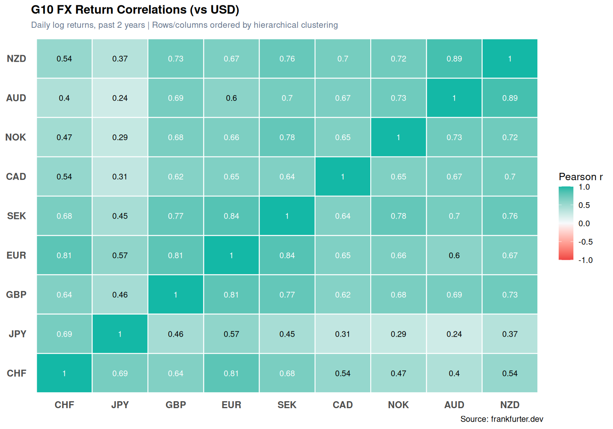
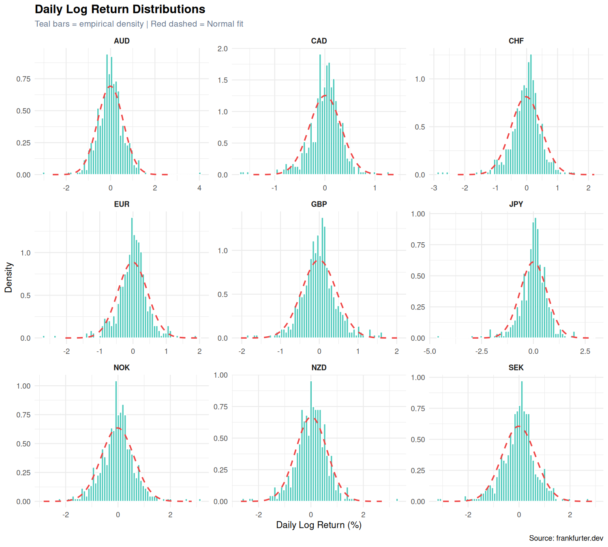
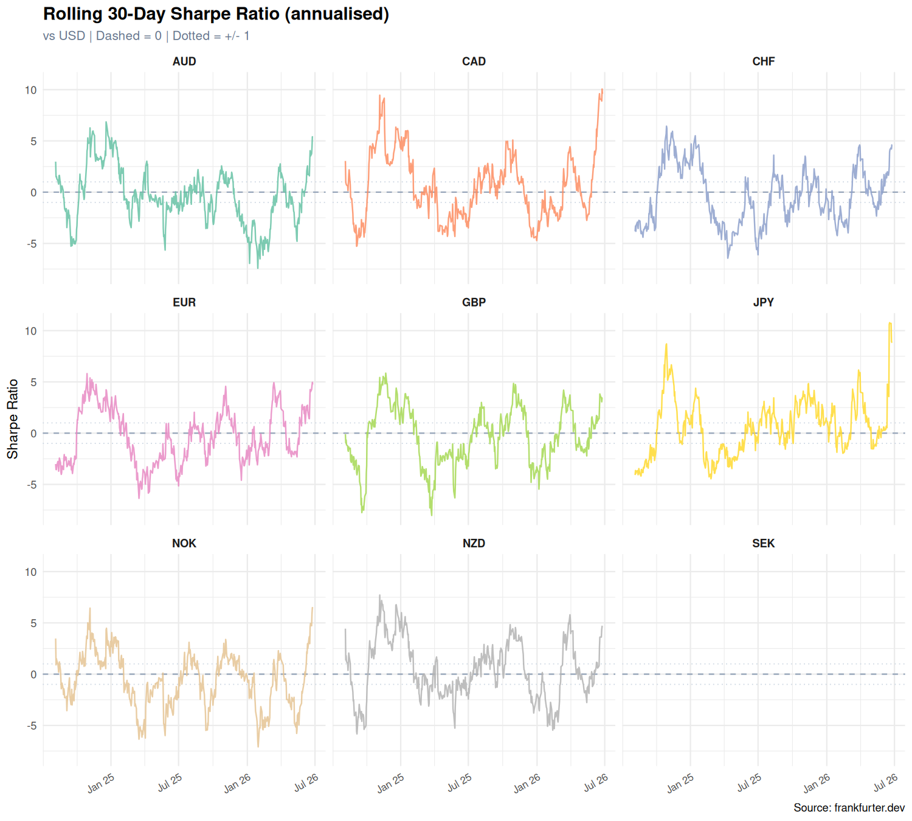
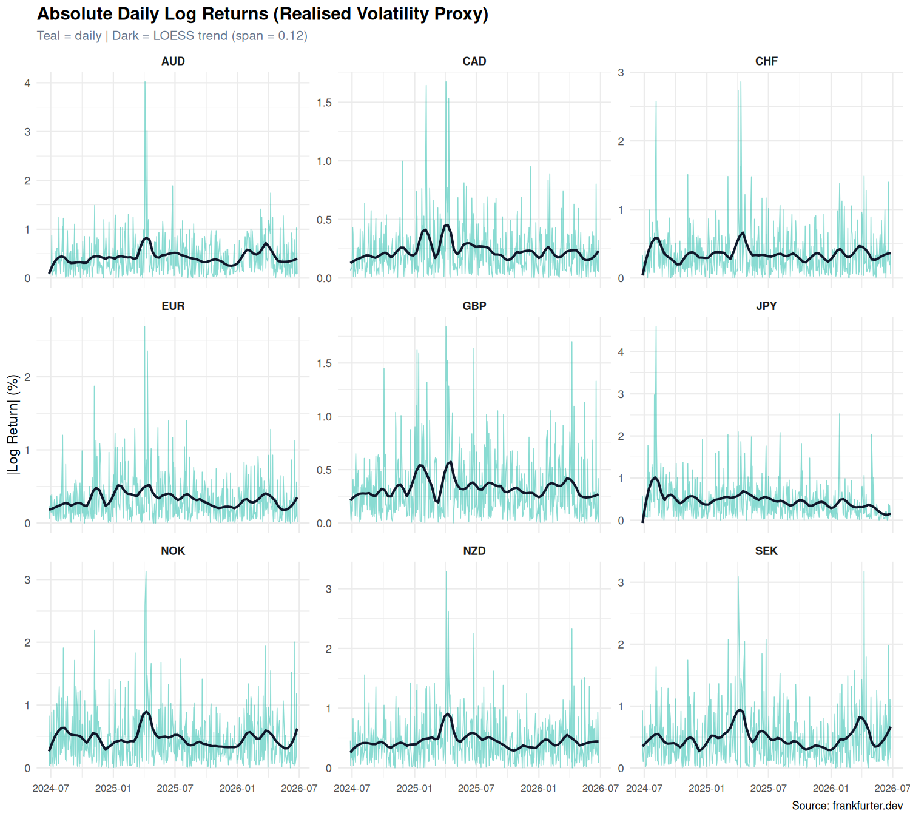

G10 FX Returns: A Statistical Analysis
================
NavyBlueCheese
2026-06-26

- [Overview](#overview)
- [1. Libraries](#1-libraries)
- [2. Fetch Data](#2-fetch-data)
- [3. Log Returns and Summary
  Statistics](#3-log-returns-and-summary-statistics)
- [4. Correlation Heatmap](#4-correlation-heatmap)
- [5. Return Distributions](#5-return-distributions)
- [6. Rolling 30-Day Sharpe Ratio](#6-rolling-30-day-sharpe-ratio)
- [7. Volatility Clustering](#7-volatility-clustering)
- [8. Key Takeaways](#8-key-takeaways)

## Overview

This notebook pulls two years of daily G10 FX spot rates from the
[Frankfurter API](https://frankfurter.dev), computes daily log returns,
and runs a set of classic quantitative checks:

- Pairwise **correlation structure** across all nine currency pairs
- **Return distributions** compared against a Normal fit (fat tails?)
- **Rolling 30-day Sharpe ratios** to track risk-adjusted performance
  over time
- **Volatility clustering** as a motivating observation for GARCH-type
  models

All nine G10 currencies (EUR, JPY, GBP, AUD, NZD, CAD, CHF, NOK, SEK)
are quoted against USD throughout.

------------------------------------------------------------------------

## 1. Libraries

``` r
library(jsonlite)
library(dplyr)
library(tidyr)
library(ggplot2)
library(purrr)
library(lubridate)
library(patchwork)
library(scales)
library(zoo)
```

------------------------------------------------------------------------

## 2. Fetch Data

The Frankfurter API returns USD-based rates for all G10 currencies in a
single request. One call covers the entire two-year window.

``` r
G10 <- c("EUR", "JPY", "GBP", "AUD", "NZD", "CAD", "CHF", "NOK", "SEK")

end_date   <- Sys.Date() - 1
start_date <- end_date - years(2)

fetch_rates <- function(start, end, base = "USD") {
  url <- sprintf(
    "https://api.frankfurter.dev/v1/%s..%s?from=%s",
    format(start, "%Y-%m-%d"),
    format(end,   "%Y-%m-%d"),
    base
  )
  # simplifyDataFrame=FALSE keeps rates as a named list of named vectors
  # (keys = dates) rather than letting jsonlite collapse it into a data.frame
  # where names() would return currency codes instead of date strings.
  resp <- fromJSON(url, simplifyDataFrame = FALSE)
  map_dfr(names(resp$rates), function(d) {
    r <- resp$rates[[d]]
    tibble(date = as.Date(d), currency = names(r), rate = as.numeric(unlist(r)))
  }) %>%
    filter(currency %in% G10)
}

fx <- tryCatch(
  fetch_rates(start_date, end_date),
  error = function(e) {
    stop("API fetch failed: ", e$message,
         "\nCheck your connection or try again later.")
  }
)

cat(sprintf("Trading days: %d | Date range: %s to %s\n",
            n_distinct(fx$date),
            min(fx$date), max(fx$date)))
```

    ## Trading days: 511 | Date range: 2024-06-25 to 2026-06-25

------------------------------------------------------------------------

## 3. Log Returns and Summary Statistics

Daily log returns are computed as `log(rate_t / rate_{t-1})`. Annualised
figures use 252 trading days.

``` r
fx_ret <- fx %>%
  arrange(currency, date) %>%
  group_by(currency) %>%
  mutate(log_ret = log(rate / lag(rate))) %>%
  ungroup() %>%
  drop_na(log_ret)

stats <- fx_ret %>%
  group_by(currency) %>%
  summarise(
    ann_return = mean(log_ret) * 252,
    ann_vol    = sd(log_ret) * sqrt(252),
    sharpe     = ann_return / ann_vol,
    skewness   = mean((log_ret - mean(log_ret))^3) / sd(log_ret)^3,
    ex_kurt    = mean((log_ret - mean(log_ret))^4) / sd(log_ret)^4 - 3,
    n_obs      = n(),
    .groups    = "drop"
  ) %>%
  arrange(desc(sharpe))

knitr::kable(
  stats %>% mutate(across(ann_return:ex_kurt, ~ round(.x, 4))),
  col.names = c("Currency", "Ann. Return", "Ann. Vol", "Sharpe",
                "Skewness", "Ex. Kurtosis", "N"),
  caption   = "Table 1: G10 FX summary statistics vs USD (2-year period)"
)
```

| Currency | Ann. Return | Ann. Vol |  Sharpe | Skewness | Ex. Kurtosis |   N |
|:---------|------------:|---------:|--------:|---------:|-------------:|----:|
| NZD      |      0.0407 |   0.0949 |  0.4291 |  -0.1511 |       2.7465 | 510 |
| CAD      |      0.0200 |   0.0505 |  0.3965 |  -0.8701 |       4.0853 | 510 |
| JPY      |      0.0074 |   0.1037 |  0.0712 |  -1.2249 |       6.2497 | 510 |
| AUD      |     -0.0177 |   0.0916 | -0.1928 |   0.2920 |       5.4627 | 510 |
| GBP      |     -0.0182 |   0.0711 | -0.2559 |   0.1111 |       1.9388 | 510 |
| NOK      |     -0.0329 |   0.0997 | -0.3302 |   0.1856 |       2.0127 | 510 |
| SEK      |     -0.0351 |   0.1047 | -0.3351 |  -0.4559 |       2.4274 | 510 |
| EUR      |     -0.0281 |   0.0713 | -0.3948 |  -0.6909 |       4.4126 | 510 |
| CHF      |     -0.0467 |   0.0779 | -0.5991 |  -1.1210 |       5.2908 | 510 |

Table 1: G10 FX summary statistics vs USD (2-year period)

------------------------------------------------------------------------

## 4. Correlation Heatmap

``` r
ret_wide <- fx_ret %>%
  select(date, currency, log_ret) %>%
  pivot_wider(names_from = currency, values_from = log_ret) %>%
  select(-date) %>%
  drop_na()

corr_mat  <- cor(ret_wide)
corr_long <- as.data.frame(corr_mat) %>%
  tibble::rownames_to_column("x") %>%
  pivot_longer(-x, names_to = "y", values_to = "corr")

# Order currencies by a simple hierarchical clustering for visual clarity
ord <- hclust(as.dist(1 - corr_mat))$order
lvls <- rownames(corr_mat)[ord]

corr_long <- corr_long %>%
  mutate(
    x = factor(x, levels = lvls),
    y = factor(y, levels = lvls)
  )

ggplot(corr_long, aes(x, y, fill = corr)) +
  geom_tile(color = "white", linewidth = 0.5) +
  geom_text(aes(label = round(corr, 2)), size = 3.3,
            color = ifelse(abs(corr_long$corr) > 0.6, "white", "black")) +
  scale_fill_gradient2(
    low      = "#ef4444",
    mid      = "#f8fafc",
    high     = "#14b8a6",
    midpoint = 0,
    limits   = c(-1, 1),
    name     = "Pearson r"
  ) +
  labs(
    title    = "G10 FX Return Correlations (vs USD)",
    subtitle = "Daily log returns, past 2 years | Rows/columns ordered by hierarchical clustering",
    x = NULL, y = NULL,
    caption  = "Source: frankfurter.dev"
  ) +
  theme_minimal(base_size = 12) +
  theme(
    axis.text      = element_text(size = 11, face = "bold"),
    plot.title     = element_text(size = 14, face = "bold"),
    plot.subtitle  = element_text(size = 10, color = "#64748b"),
    legend.position = "right",
    panel.grid     = element_blank()
  )
```

<!-- -->

------------------------------------------------------------------------

## 5. Return Distributions

Normal returns would hug the dashed red curve. FX returns almost always
show heavier tails (positive excess kurtosis) — meaning extreme moves
are more frequent than a Gaussian model would predict, with direct
implications for Value-at-Risk estimates.

``` r
normal_curves <- fx_ret %>%
  group_by(currency) %>%
  summarise(
    mu    = mean(log_ret * 100),
    sigma = sd(log_ret * 100),
    .groups = "drop"
  ) %>%
  pmap_dfr(function(currency, mu, sigma) {
    x_seq <- seq(mu - 4.5 * sigma, mu + 4.5 * sigma, length.out = 400)
    tibble(currency = currency, x = x_seq, y = dnorm(x_seq, mu, sigma))
  })

ggplot(fx_ret, aes(x = log_ret * 100)) +
  geom_histogram(
    aes(y = after_stat(density)),
    bins  = 70,
    fill  = "#14b8a6",
    color = "white",
    alpha = 0.75
  ) +
  geom_line(
    data = normal_curves,
    aes(x = x, y = y),
    color     = "#ef4444",
    linewidth = 0.8,
    linetype  = "dashed"
  ) +
  facet_wrap(~currency, ncol = 3, scales = "free") +
  labs(
    title    = "Daily Log Return Distributions",
    subtitle = "Teal bars = empirical density | Red dashed = Normal fit",
    x        = "Daily Log Return (%)",
    y        = "Density",
    caption  = "Source: frankfurter.dev"
  ) +
  theme_minimal(base_size = 11) +
  theme(
    strip.text    = element_text(face = "bold"),
    plot.title    = element_text(size = 14, face = "bold"),
    plot.subtitle = element_text(size = 10, color = "#64748b")
  )
```

<!-- -->

------------------------------------------------------------------------

## 6. Rolling 30-Day Sharpe Ratio

A 30-day rolling Sharpe (annualised) captures how quickly the
risk-adjusted return regime shifts. The dotted lines at +/-1 indicate a
commonly used threshold for “decent” risk-adjusted returns.

``` r
roll_sharpe <- fx_ret %>%
  arrange(currency, date) %>%
  group_by(currency) %>%
  mutate(
    r_mean   = rollapply(log_ret, 30, mean, fill = NA, align = "right"),
    r_sd     = rollapply(log_ret, 30, sd,   fill = NA, align = "right"),
    r_sharpe = (r_mean * 252) / (r_sd * sqrt(252))
  ) %>%
  ungroup() %>%
  drop_na(r_sharpe)

ggplot(roll_sharpe, aes(x = date, y = r_sharpe, color = currency)) +
  geom_hline(yintercept = c(-1, 1), linetype = "dotted",
             color = "#cbd5e1", linewidth = 0.4) +
  geom_hline(yintercept = 0, linetype = "dashed",
             color = "#94a3b8", linewidth = 0.5) +
  geom_line(alpha = 0.85, linewidth = 0.55) +
  facet_wrap(~currency, ncol = 3) +
  scale_color_brewer(palette = "Set2") +
  scale_x_date(date_breaks = "6 months", date_labels = "%b %y") +
  labs(
    title    = "Rolling 30-Day Sharpe Ratio (annualised)",
    subtitle = "vs USD | Dashed = 0 | Dotted = +/- 1",
    x        = NULL,
    y        = "Sharpe Ratio",
    caption  = "Source: frankfurter.dev"
  ) +
  theme_minimal(base_size = 11) +
  theme(
    legend.position = "none",
    strip.text      = element_text(face = "bold"),
    plot.title      = element_text(size = 14, face = "bold"),
    plot.subtitle   = element_text(size = 10, color = "#64748b"),
    axis.text.x     = element_text(size = 8, angle = 30, hjust = 1)
  )
```

<!-- -->

------------------------------------------------------------------------

## 7. Volatility Clustering

Absolute returns proxy realised volatility. If volatility clusters (a
GARCH stylised fact), spikes should appear in bursts rather than
uniformly across time. The LOESS trend line makes this visible.

``` r
fx_ret %>%
  mutate(abs_ret = abs(log_ret) * 100) %>%
  ggplot(aes(x = date, y = abs_ret)) +
  geom_line(color = "#14b8a6", alpha = 0.5, linewidth = 0.35) +
  geom_smooth(
    method = "loess", span = 0.12, se = FALSE,
    color = "#0f172a", linewidth = 0.9
  ) +
  facet_wrap(~currency, ncol = 3, scales = "free_y") +
  labs(
    title    = "Absolute Daily Log Returns (Realised Volatility Proxy)",
    subtitle = "Teal = daily | Dark = LOESS trend (span = 0.12)",
    x        = NULL,
    y        = "|Log Return| (%)",
    caption  = "Source: frankfurter.dev"
  ) +
  theme_minimal(base_size = 11) +
  theme(
    strip.text    = element_text(face = "bold"),
    plot.title    = element_text(size = 14, face = "bold"),
    plot.subtitle = element_text(size = 10, color = "#64748b"),
    axis.text.x   = element_text(size = 8)
  )
```

<!-- -->

------------------------------------------------------------------------

## 8. Key Takeaways

- **Fat tails confirmed**: Every currency shows positive excess
  kurtosis, so a Normal VaR model will systematically underestimate tail
  risk.

- **Bloc correlations**: EUR, NOK, SEK, and CHF cluster together
  (European risk bloc). AUD and NZD are highly correlated with each
  other (commodity currencies). JPY and CHF are frequently negatively
  correlated with risk-on currencies during stress.

- **Sharpe regimes are short-lived**: No currency holds a consistently
  high or low Sharpe vs USD across the full two-year window. Regime
  changes dominate any carry of the “trend.”

- **Volatility clustering visible**: The LOESS trend clearly shows
  periods of elevated realised vol, consistent with GARCH(1,1) dynamics.
  This motivates using time-varying volatility models rather than
  constant-vol assumptions.

------------------------------------------------------------------------

*Data: [Frankfurter API](https://frankfurter.dev) — free, no API key
required. For educational purposes only.*
